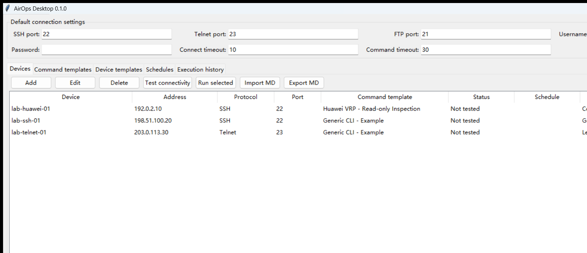
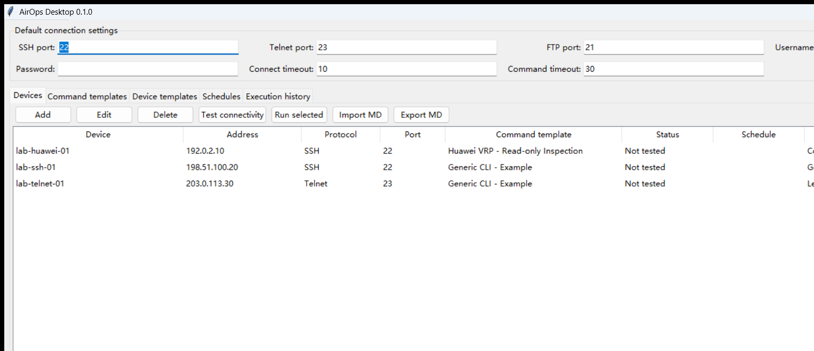
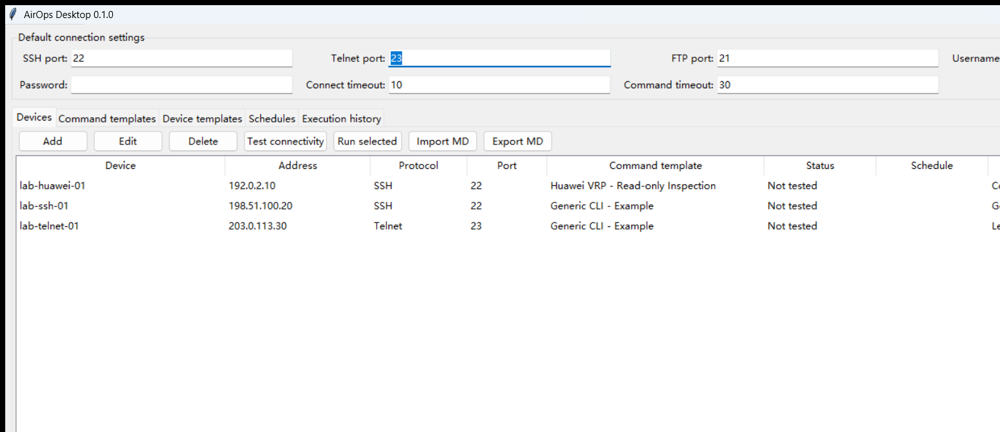

# AirOps Desktop

  <strong>Lightweight. Offline-first. Portable.</strong>

  <a href="./README.md">English</a> |
  <a href="./README.zh-CN.md">简体中文</a>

AirOps Desktop is a lightweight Windows desktop toolkit for operating network
devices in **intranet, restricted, isolated and air-gapped environments**.
It is designed to work locally without cloud services, a web server, Docker,
or Internet access at runtime.

> Current status: early public release `v0.1.0`

## Screenshots

### Device inventory

  

### Command and device templates

<table>
  <tr>
    <td width="50%"></td>
    <td width="50%"></td>
  </tr>
  <tr>
    <td align="center">Command templates</td>
    <td align="center">Device templates</td>
  </tr>
</table>

## Why AirOps Desktop

Many production, industrial, enterprise and security-sensitive networks cannot
depend on SaaS platforms, cloud agents or Internet-connected management systems.

Typical environments include:

- no Internet access or heavily restricted Internet access;
- logical or physical network isolation;
- mixed device vendors and legacy protocols;
- routine SSH / Telnet inspection and configuration collection;
- limited deployment resources;
- strict requirements that device inventory and credentials remain local.

AirOps Desktop targets this exact class of environments:

> **A lightweight desktop toolkit that keeps common network operations local, portable and offline-first.**

It is not intended to replace full NCM / DCIM platforms such as NetBox,
rConfig or Oxidized. Its focus is instead on:

**simple deployment, local execution, desktop workflows, portability and field usability.**

## Current features

- local device inventory
- SSH and Telnet device access
- configurable SSH, Telnet and FTP ports
- reusable device templates
- reusable command templates
- concurrent connectivity checks
- concurrent batch execution
- long-running CLI output collection
- privilege / enable mode support
- FTP file download
- daily scheduled tasks
- execution history
- Markdown device import / export
- local SQLite storage
- portable Windows executable
- local logs and execution result files

## Built-in public templates

The public repository intentionally contains only generic or publicly
documented templates:

- `Generic SSH`
- `Generic Telnet`
- `Huawei VRP`

Production device definitions, credentials, private addresses, internal command
sets and operational data are not included in the public repository.

## Portable layout

~~~text
AirOps-Desktop/
├─ AirOps-Desktop.exe
├─ data/
│  └─ airops_desktop.db
├─ logs/
└─ results/
~~~

Copy the whole directory to move the application together with its local data.

## Good fit for

- offline operations workstations
- isolated or air-gapped networks
- intranet network inspection
- small and medium device fleets
- mixed SSH / Telnet environments
- field engineering and lab environments
- cases where deploying a full web platform would be excessive

## Not intended to be

AirOps Desktop is currently not:

- an enterprise CMDB / DCIM platform;
- a multi-tenant SaaS service;
- a distributed orchestration platform;
- a zero-trust credential management system;
- a full configuration compliance platform.

For larger environments, mature projects such as NetBox, Oxidized, Nornir and
rConfig may be more appropriate.

## Security notes

AirOps Desktop is offline-first, but **offline does not automatically mean secure**.

Known limitations in `v0.1.0`:

- device passwords are currently stored in plaintext SQLite;
- Telnet transmits credentials and CLI traffic without encryption;
- SSH currently accepts unknown host keys automatically;
- local database and result-file protection depends on host OS controls.

Use Telnet only where legacy equipment requires it and only on trusted isolated
networks.

See [SECURITY.md](SECURITY.md).

## Development

Requirements:

- Windows
- Python 3.11
- Tkinter / ttk
- SQLite
- Paramiko
- PyInstaller

~~~powershell
py -3.11 -m venv .venv
.\.venv\Scripts\Activate.ps1
pip install -e .
python -m airops_desktop
~~~

Or run:

~~~powershell
run.bat
~~~

Build a portable executable:

~~~powershell
build_onefile.bat
~~~

Output:

~~~text
release/AirOps-Desktop.exe
~~~

## Roadmap

- [ ] Driver / Model abstraction
- [ ] Windows DPAPI credential encryption
- [ ] SSH Host Key verification policy
- [ ] Configuration version history and diff
- [ ] Structured inspection results
- [ ] More public device drivers
- [ ] Automated Windows releases
- [ ] Improved logging and diagnostics

## Contributing

Issues and pull requests are welcome.

When contributing examples or test data:

- use RFC 5737 documentation addresses:
  - `192.0.2.0/24`
  - `198.51.100.0/24`
  - `203.0.113.0/24`
- do not submit real production IP addresses;
- do not submit real credentials;
- do not submit customer or project names;
- do not submit production configuration files or real device logs.

Before committing, run:

~~~powershell
python scripts/check_public_safety.py
python -m unittest discover -s tests -v
~~~

## License

MIT License
